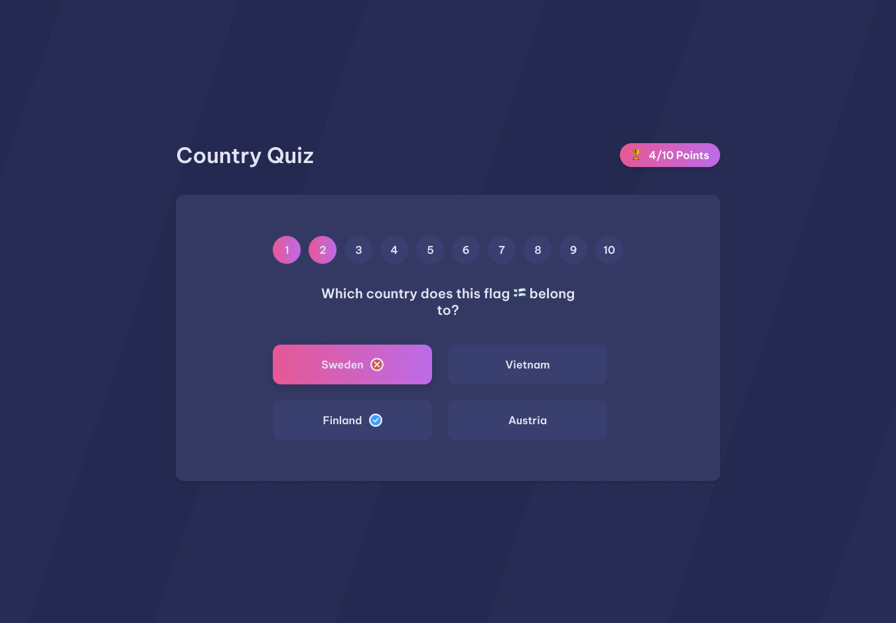

<h1 align="center">Country Quiz | devChallenges</h1>

   Solution for a challenge <a href="https://devchallenges.io/challenge/country-quizz" target="_blank">Country Quiz</a> from <a href="http://devchallenges.io" target="_blank">devChallenges.io</a>.

  <h3>
    <a href="https://country-quiz-sheraz.netlify.app">
      Demo
    </a>
     | 
    <a href="https://github.com/sherazmalik-se/sheraz-ahmad/tree/main/projects/devchallenges/frontend-libraries/country-quiz">
      Solution
    </a>
     | 
    <a href="https://devchallenges.io/challenge/country-quiz">
      Challenge
    </a>
  </h3>

## Overview

### Built with

- Semantic HTML5 markup
- [Tailwind CSS](https://tailwindcss.com/)
- JavaScript
- React JS

## Author

- Website [@sherazmalik-se](https://www.linkedin.com/in/sherazmalik-se)
- GitHub [@sherazmalik-se](https://github.com/sherazmalik-se)
