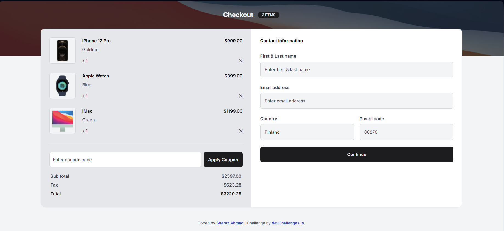

<h1 align="center">Device Shop Checkout | devChallenges</h1>

   Solution for a challenge <a href="https://devchallenges.io/challenge/apple-shop-checkout-page-challenge" target="_blank">Device Shop Checkout</a> from <a href="http://devchallenges.io" target="_blank">devChallenges.io</a>.

  <h3>
    <a href="https://sheraz-ahmad.netlify.app/projects/device-shop-checkout/index.html" target="_blank">
      Demo
    </a>
     | 
    <a href="https://github.com/sherazmalik-se/device-shop-checkout">
      Solution
    </a>
     | 
    <a href="https://devchallenges.io/challenge/apple-shop-checkout-page-challenge">
      Challenge
    </a>
  </h3>

## Overview

### Built with

- Semantic HTML5 markup
- CSS custom properties
- Flexbox
- CSS Grid
- [Tailwind](https://tailwindcss.com/)

## Author

- Website [@sherazmalik-se](https://www.linkedin.com/in/sherazmalik-se)
- GitHub [@sherazmalik-se](https://github.com/sherazmalik-se)
